# ComfyUI H3 Studio

[](https://buymeacoffee.com/lorasandlenses)
[](https://opensource.org/licenses/MIT)

**A video editor for MiniMax H3, inside a single ComfyUI node.** Keyframes with
independent strength dials, a fullscreen timeline, clip-to-clip continuation
with real motion and audio continuity, and a reel you can trim, score and
export as one video.

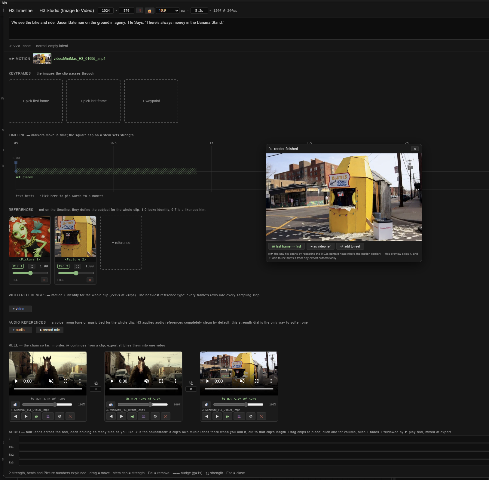

> Want one-line answers instead? [Quick recipes](GUIDE.md).

## Install

```bash
cd ComfyUI/custom_nodes
git clone https://github.com/shootthesound/ComfyUI-H3Studio
```

Restart ComfyUI, then **hard-refresh the browser** (Ctrl+Shift+R) — the pack
ships a frontend extension. No extra Python dependencies. Needs a ComfyUI build
with MiniMax H3 support (v0.30.0 / commit `57500fc` onwards).

## Start here

Drag **`example_workflows/Basic_usage.json`** onto the ComfyUI canvas. It is the
whole pipeline already wired: loaders, the turbo LoRA, the H3 Studio node,
sampler, and video+audio save. Point the loaders at your own model files, hit
run, and you have a clip.

That workflow is the recommended starting point for everything below — the rest
of this page is things you can add to it.

## Your first clip

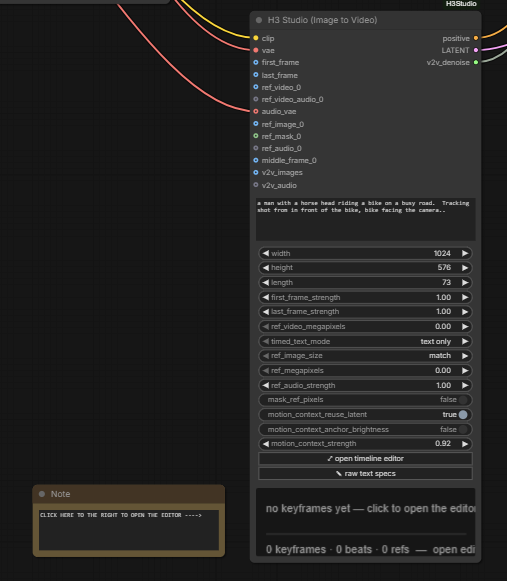

**⤢ Where's the editor?** On the node itself — the **⤢ open timeline editor**
button, right there in the screenshot. The node is a doorway; its widgets are
only what the editor writes, so you never need to touch them.

1. Click **⤢ open timeline editor** on the node.
2. Click **+ pick first frame** and choose an image.
3. Type a prompt.
4. **▶ queue**.

<br clear="right">

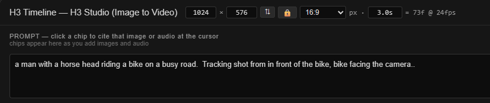

Size, clip length and the frame count sit in the header; the prompt is right
under it. Everything else lives in that editor — you never need to leave
fullscreen.

## What the editor gives you

- **Keyframes** — first frame, last frame, and waypoints in between, each with
  its own strength dial. Strength is the whole point: `1.0` hits that frame
  exactly, `0.6–0.8` keeps its composition and colour but frees the motion.
- **Timeline** — drag markers to move a keyframe in time; the square cap on each
  stem sets its strength. Text beats pin words to a moment.
- **References** — images that define a subject for the *whole* clip rather than
  a moment. Plus reference audio and reference video. Each one becomes a chip
  above the prompt: click it to cite that picture where your cursor is.
- **Reel** — finished clips chained at the bottom, with trims, crossfades,
  per-clip volume, audio lanes, and one-button export.

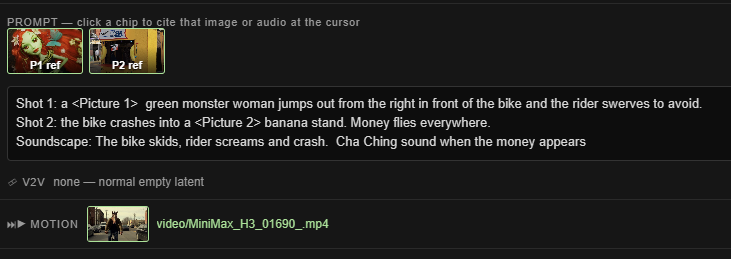

## If you want to…

### …end on a specific image
Set the **last frame** card. `1.0` lands on it exactly; `0.6–0.8` treats it as a
target to head toward. If you only loosen one end, loosen this one — the first
frame anchors the shot's geometry, so diluting *it* can destabilise the whole clip.

### …pass through an image mid-clip
**+ waypoint** → pick the image → drag its marker to the right moment. Keep
strength around `0.6–0.8`. Add a short description on the card so the model knows
what it is looking at. (Waypoints are the experimental end of this pack — see
Honest limits.)

### …make the next clip continue this one
Hit **▶ queue** with a clip in the reel and a chooser appears:

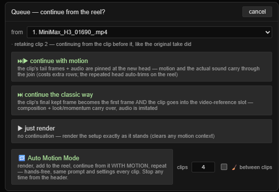

- **⏭▶ continue with motion** — the previous clip's tail frames *and audio* are
  pinned at the new head. Same motion, same direction, the same waveform carried
  on rather than imitated. The render opens by repeating that pinned tail, which
  **🎞 add to reel** trims off automatically.
- **⏭ continue the classic way** — its final frame becomes the first frame and
  the clip goes into the video-reference slot. Cheaper; motion restarts at the join.
- **▶ just render** — no continuation.

The loop is *queue → choose → render → 🎞 add to reel → queue again*.

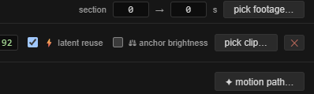

The MOTION bar carries the dials: how many frames to pin, **⚡ latent reuse**
(hands the previous clip's own latent over instead of decoding and re-encoding
it, which is what stops quality compounding down a chain), and **⚖ anchor
brightness** if a long chain starts to drift.

### …check whether a join actually worked
Add **H3 Seam Probe** and give it this clip's audio *before* the trim, the audio
of the clip it continues, and the same frame count you pinned. It measures four
things and passes the audio through unchanged, so it can live in the graph
permanently:

```
continuation  : lag +0.4 ms, correlation 0.981  -- continuation, on time
level at cut  : +0.31 dB  -- inaudible
room tone     : +0.12 dB  -- inaudible
```

The measurement set, its thresholds and the finding that made it necessary are
**ComfyUI-H3-Motion-Context**'s, same as the motion-context technique itself.

**Correlation** is the one that matters. Above `0.9` the model continued your
actual waveform; around `0.5` it wrote something that merely *sounds like* it,
which is the failure continuation exists to prevent and is easy to miss by ear on
one join. Lag catches drift, and the two dB figures catch a level or room-tone
jump at the cut. Chain degradation is cumulative and small per link, so measuring
one join beats watching six.

### …put a sound at a moment — EXPERIMENTAL
`sound_anchors` on the node, one line per anchor:

```
0.4, door-slam.wav
72, 0.7, phone-ring.wav
```

Position is a fraction of the clip or a frame number; the optional middle number
is a strength. The sound is pinned *at* that frame and the model renders the
picture that goes with it.

This is not the reel's fx lanes — those mix a sample over a finished video. This
one is a **condition**: the model hears it while rendering. Keep the files short,
since an anchored sound holds audio rows for its whole length.

### …build several clips hands-free
Pick **Auto Motion Mode** in that same chooser and give it a clip count. It
queues, adds to the reel, and continues from itself that many times, same prompt
and settings each clip. Stop it any time from the header.

### …keep the same person across clips
Add their photos with **+ reference** (`1.0` locks identity, `0.7` is a likeness
hint), then **🎭 cast → 💾 save cast member**. From any other clip or workflow,
**🎭 cast** → add, and their images, strengths and framings come back in one click.

### …put music under it
**♪ music** in the timeline header — pick a file (input folder, upload, mic, or
the built-in free web search) and its waveform and detected beats draw on the
track. Set **use** to *soundtrack* and the song lands on the **♪ lane** in AUDIO:
one chip per clip, each cut to that clip's length. Drag a chip to move it, drag
either end to trim, click it for volume and fades.

Set **use** to *timing only* if you just want the beats to aim at, or *model
reference* if you want the model to imitate the sound's character.

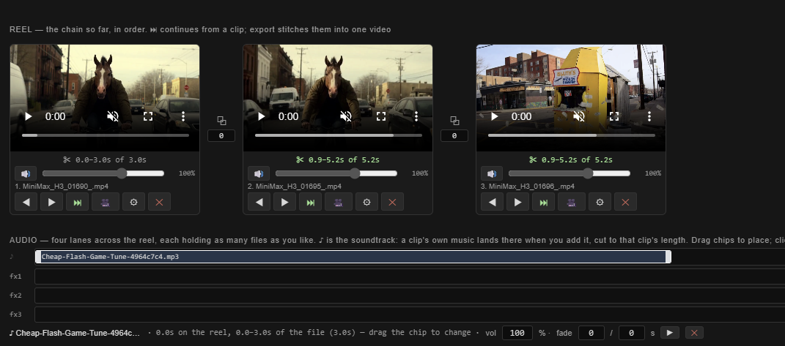

### …add sound effects
Three **fx lanes** sit under the soundtrack lane, and they work identically —
each holds as many files as you like. **+** on a lane opens the audio picker;
the sample lands as a chip you drag into place.

### …find images or sounds without leaving ComfyUI
Any picker has a **🌐 web…** tab: type a search and results come from Openverse,
all Creative Commons or public domain, with the licence and creator on every
card. Clicking one downloads it into `input/web/` and uses it immediately, and
every pull is logged to `input/web/credits.txt` for attribution.

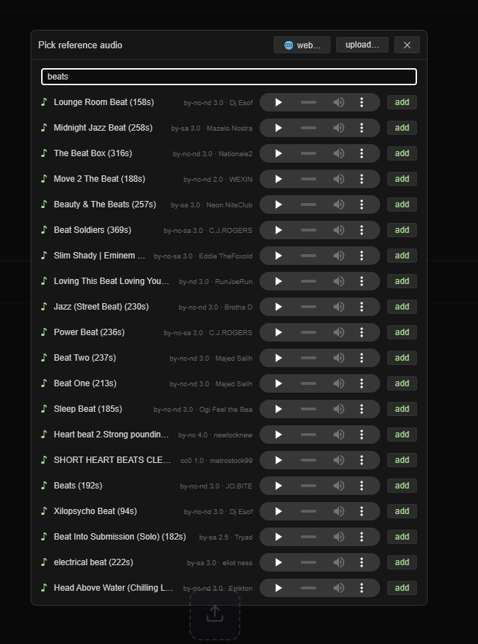

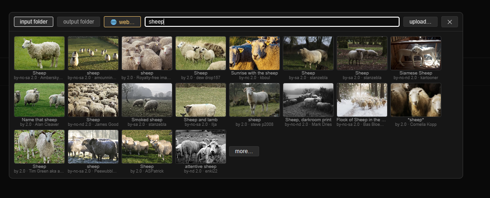

### …export the whole thing as one video
**⇧ export as one video** on the reel. Per-clip in/out trims, crossfades at the
joins, whole-reel fade in/out, per-clip volume, the soundtrack and every fx lane
are mixed server-side. **▶ play reel** previews the lot first, without exporting.


Each card carries the clip that made it. **✂** trims it without touching the
file, the slider sets its volume in the mix, and **⚙** brings the whole setup
that produced it back into the editor.

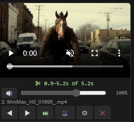

### …restyle existing footage (v2v)
Load a clip into **V2V** at the top of the editor (drag and drop works), set the
section and a denoise around `0.5`, and prompt the change you want. **match
aspect** conforms the output to the footage.

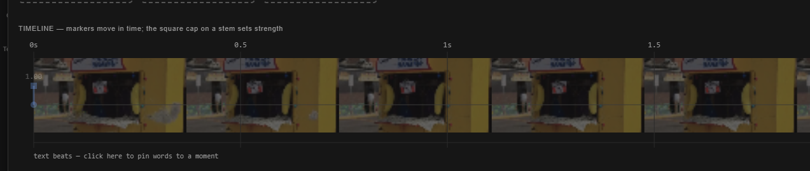

The footage draws faintly under the timeline, so you can place keyframes and
beats against what is actually happening in the shot. The slider beside it sets
how visible that is, down to nothing.

### …change only part of the frame
**H3 Soft Denoise Zone** takes your latent and a mask and holds everything
outside it still — a circular fade-out, or a per-frame SAM2 mask tracking a
person. Feed the *same* mask into **H3 Regional Prompt** to also say what belongs
in that region, rather than only where change is allowed.

### …fix a crop or aspect mismatch
Every image and video card has **⛶**. Drag and zoom the window over what the
model should see. Keyframe windows are locked to the output aspect, so what you
frame is exactly what it gets. Without a framing, a mismatched image is
centre-cropped — the card warns you which edges are going.

### …get a camera move out of one still
**✦ motion path…** on the KEYFRAMES header: drag the **A** and **B** windows,
pick a speed curve, and it places tween waypoints along it. **▶ preview move**
shows the exact move before you spend a single sampling step.

### …dial the motion up or down — EXPERIMENTAL
Every other control here describes *what* should happen. **motion_scale** changes
the model's **clock** instead — the time it believes passes between frames — so
the same content has to cover more or less movement. `1.0` is stock, `1.3` is
livelier, `0.7` calms a clip down. **motion_curve** does the same thing but
varying across the clip: `position, speed` on each line, ramped between the
points you give, for a shot that settles and then accelerates.

Stay near `0.8–1.3`. Further out drifts away from anything the model was trained
on, and the soundtrack is *not* rescaled, so picture and sound pull apart the
further you go from `1.0`. At exactly `1.0` with an empty curve nothing is
touched at all.

> **These two are new and may not stay.** They are the least proven controls in
> the pack — the geometry is sound and everything anchored to a frame (keyframes,
> beats, motion-context joins) travels with the clock correctly, but whether the
> model *reads* a stretched clock as "more happens here" is the open question. If
> you try them, please say what you saw in the
> [issues](https://github.com/shootthesound/ComfyUI-H3Studio/issues).

### …make it faster
The example workflow already uses the **turbo LoRA** at 6 steps. It samples
through core's own **KSamplerSelect**, *not* the special sampler node that ships
alongside the turbo LoRA loader — recent ComfyUI builds don't need that node and
give better results without it. If you are carrying an older copy of the
workflow, swap it for KSamplerSelect. Beyond that,
reference *video* is the expensive part — every frame's rows ride every sampling
step. Cap it with **video refs MP** (`0.4` is a good start). The references
header shows a live cost meter.

## The nodes

| Node | For |
|---|---|
| **H3 Studio (Image to Video)** | The main event — everything above happens here |
| **H3 Soft Denoise Zone (v2v)** | Restyle one region of the footage; feathered, no matte line |
| **H3 Regional Prompt (mask)** | Point part of the prompt at the masked region |
| **H3 Basic Scheduler (wired denoise)** | Core's scheduler with denoise as a socket, so v2v_denoise drives it. Its `rescale` mode also fixes core's dead zone at high denoise |
| **MiniMax H3 Temporal LoRA Blend** | Different LoRA weights before and after a moment inside the clip |
| **H3 Seam Probe** | Measure a join: is the audio really continued, and do level or room tone step at the cut |

> **Temporal LoRA Blend needs testing.** It is the least exercised node here —
> the maths is sound and it runs, but how it behaves across real LoRAs, boundary
> positions and feather widths is barely mapped. If you try it, good result or
> bad, please say so in the
> [issues](https://github.com/shootthesound/ComfyUI-H3Studio/issues) — that
> feedback is worth more than more theory.

## Honest limits

- **Waypoints are out of distribution.** H3 was trained on first/last anchors
  only. The positions a middle keyframe gets are mathematically correct and the
  model does attend to them, but whether one reads as "be here at 2.5s" or
  smears across the clip is genuinely unknown. Keep their strength low. This is
  the one feature that might simply not work well; the strength dials are on
  much firmer ground.
- **Strength is constant across sampling**, not a fade. Below about `0.3` a
  keyframe gets unpredictable rather than gracefully vague.
- **Sub-`0.5` on the first frame is experimental** — it anchors geometry for the
  whole clip, not just the opening.
- **The `rope` timed-text modes are a gamble.** Text has lived in its own
  coordinate space for every sample the model ever saw. `text only` is the
  default for that reason.
- **Motion context**: audio dulls slightly at every join down a long chain, and
  a constant ~10 ms offset per link is unfixed. Restart the chain at a natural
  transition when you hear it. It also conflicts with running
  ComfyUI-H3-Motion-Context in the same session — pick one pack.
- **Above `1.0` strength is unclamped** and off-distribution. It is there
  because sometimes you want it. It can also blow out the ending.
- **`sound_anchors` is experimental**, and needs a ComfyUI new enough to anchor
  audio at a frame (the `MiniMaxH3AddGuide` change). On older builds the anchors
  are skipped with a warning rather than silently ignored; nothing else about the
  render changes.
- **Strength dials need the per-row label patch.** Every keyframe strength and
  `motion_context_strength` below `1.0` relabels its row's timestep to match how
  far it was blended. That patch reads ComfyUI's live source, so a change upstream
  can disable it — you get a warning at render time and a softer, less clean
  fallback, not a wrong render. If you see it, the pack needs an update.
- **`motion_scale` / `motion_curve` are experimental and may be removed.** They
  rescale the RoPE time axis, which is off-distribution the moment you leave
  `1.0`, and audio is deliberately left on the original clock.
- Inherits every stock H3 constraint: batch size 1, frame counts snap to the
  17k+5 grid at 24fps, trained range roughly 124–362 frames.
- **Timeline thumbnails are best-effort** — they come from the upstream node's
  own preview. A source with no browser-side preview shows a placeholder. The
  marker still works; only the picture is missing.
- The node is fully operable without the editor (**✎ raw text specs** exposes
  the underlying fields), which also covers browsers where the extension fails
  to load.

## Support

If this tool saves you time or fits into your workflow, consider [buying me a coffee](https://buymeacoffee.com/lorasandlenses). Members get early access to new builds before public release.

[](https://buymeacoffee.com/lorasandlenses)

---

Peter Neill — [ShootTheSound.com](https://shootthesound.com) / [UltrawideWallpapers.net](https://ultrawidewallpapers.net)

Background in music industry photography and video, which is where most of these
tools come from — they get built because a real shoot needed them.

Feedback is welcome — open an issue or reach out.

## License

MIT
